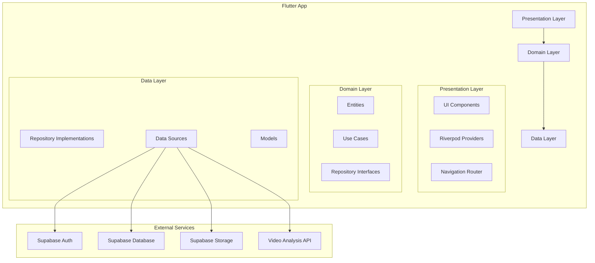
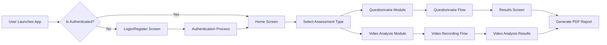
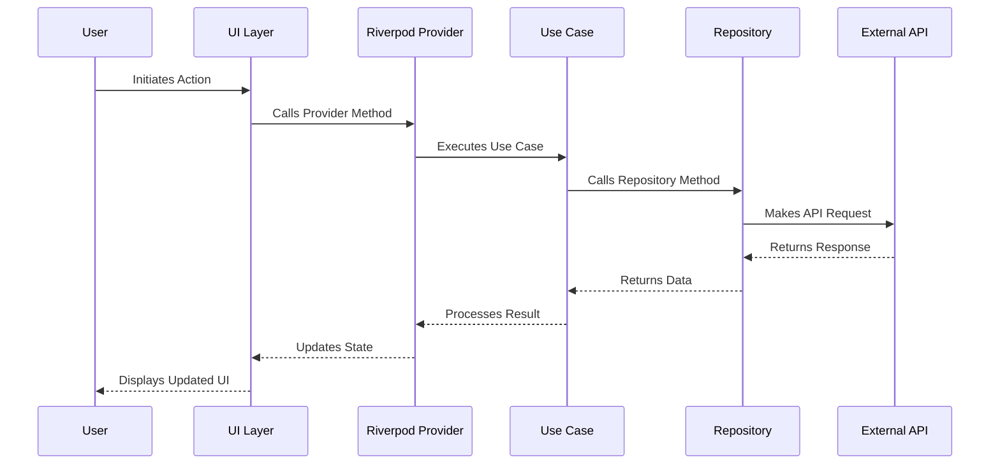
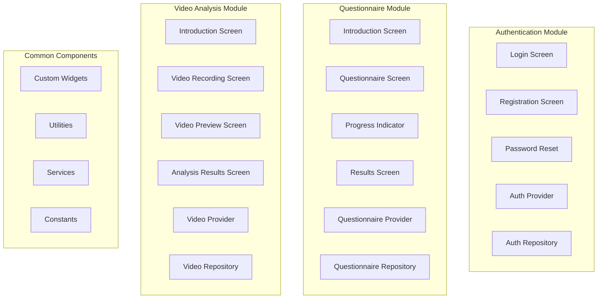
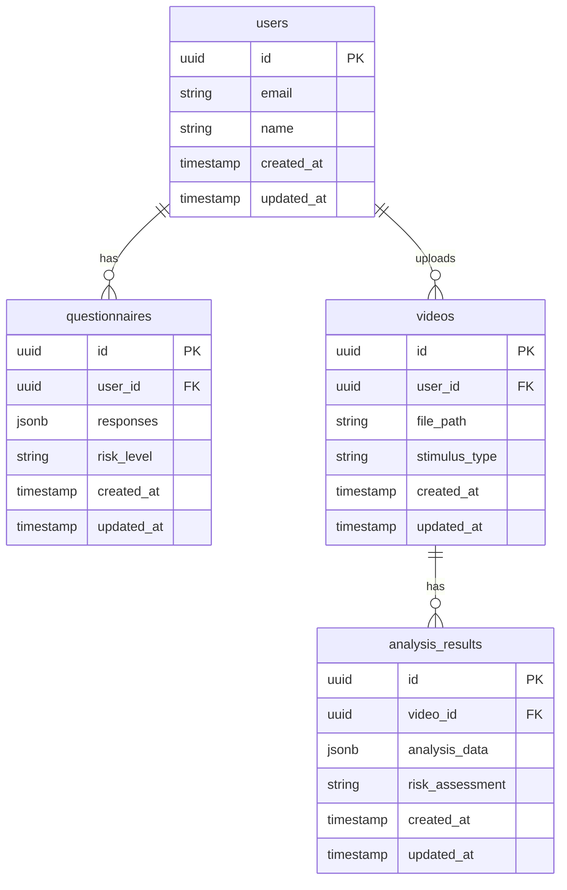
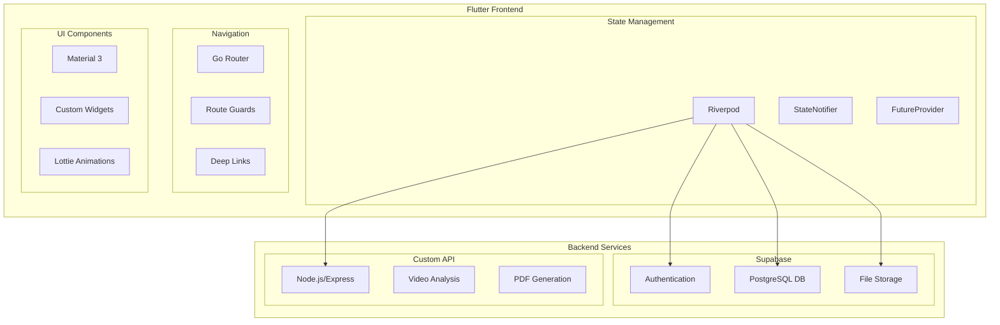

# System Architecture Diagram

## High-Level System Architecture



## Application Flow Architecture



## Data Flow Architecture



## Module Architecture



## Database Schema (Supabase)



## Technology Integration Architecture



## Security Architecture

```mermaid
graph TB
    subgraph "Client Side"
        C1[Flutter Secure Storage]
        C2[JWT Token Management]
        C3[Data Encryption]
    end
    
    subgraph "Network Layer"
        N1[HTTPS/TLS]
        N2[API Key Authentication]
        N3[Request Validation]
    end
    
    subgraph "Server Side"
        S1[Supabase Auth]
        S2[Row Level Security]
        S3[Data Encryption at Rest]
    end
    
    C1 --> N1
    C2 --> N2
    C3 --> N3
    N1 --> S1
    N2 --> S2
    N3 --> S3